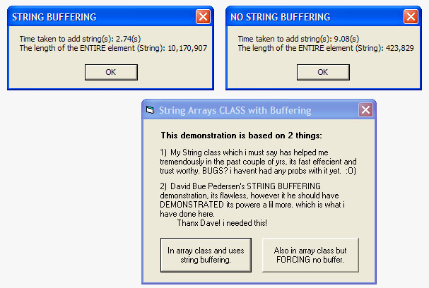



## String Array Class With Buffering

### Description

String Concentation SPEED! THis is a class that i had developed and IMPROVED upon with David Bue Pedersen's String Buffer CODE..................................................................................................................... UPDATE: My appologies to all that used this, i had mistakenly used a VERSION of the class where i had manipulated the "IsInArray" function. This i have fixed, ALSO as recomended by some feedback , i changed some return values and added a couple of return values(ByRef). Thanx and please VOTE! :O)
 
### More Info
 
Pimples, and mile irritation

             |
---                |---
**Submitted On**   |2002-07-17 19:06:58
**By**             |[Chris H\. CJDigital](https://github.com/Planet-Source-Code/PSCIndex/blob/master/ByAuthor/chris-h-cjdigital.md)
**Level**          |Intermediate
**User Rating**    |5.0 (15 globes from 3 users)
**Compatibility**  |VB 6\.0
**Category**       |[VB function enhancement](https://github.com/Planet-Source-Code/PSCIndex/blob/master/ByCategory/vb-function-enhancement__1-25.md)
**World**          |[Visual Basic](https://github.com/Planet-Source-Code/PSCIndex/blob/master/ByWorld/visual-basic.md)
**Archive File**   |[String\_Arr1074357172002\.zip](https://github.com/Planet-Source-Code/chris-h-cjdigital-string-array-class-with-buffering__1-36963/archive/master.zip)

